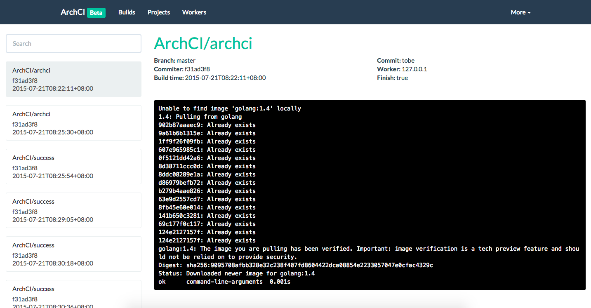

# ArchCI Demo

## Introduction

Setup [ArchCI](https://github.com/ArchCI/archci) service within minutes! Happy hacking :tada: 

## Tutorial

Start [mysql](https://github.com/tobegit3hub/mysql_docker) database.

```
docker run -d -e MYSQL_ROOT_PASSWORD=root -p 3306:3306 mysql:5.7
```

Start [redis](https://github.com/tobegit3hub/redis_docker) service.

```
docker run -d -p 6379:6379 redis:3.0
```

Start [archci](https://github.com/ArchCI/archci) server.

```
docker run -d --net=host archci/archci
```

If you're using overlayfs, start [simple-worker](https://github.com/ArchCI/simple-worker) worker.

```
docker run -d --net=host --privileged archci/simple-worker
```

If you're using aufs, start with `-e AUFS=true`.

```
docker run -d --net=host --privileged -e AUFS=true archci/simple-worker
```

## Usage

Go to <http://127.0.0.1:10010> and add new project for continuous integration.


